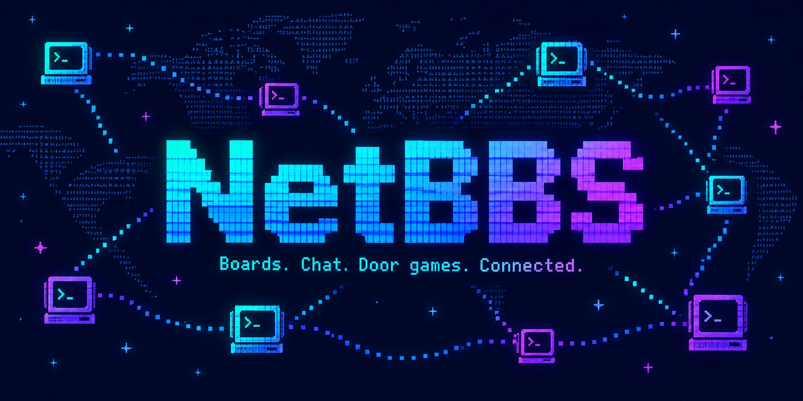

# NetBBS

**A text-based home for your community.** NetBBS brings message boards,
live chat, personal mail, file sharing, and door games together on a server
you run and moderate. Callers connect with a web browser, SSH, or Telnet.

Run a standalone BBS, or connect it to other independently operated nodes
through **NetBBS Link** to share conversations and content. You choose what
your node carries and who it trusts.

[See the screens](https://www.netbbs.org/) ·
[Download a release](https://github.com/Thiesi/NetBBS/releases) ·
[Install NetBBS](docs/NetBBS-SysOp-Handbook.md#installing-netbbs)

## What you can do

- Organize message boards, chat channels, and file areas into Communities.
- Read and write posts, follow discussions, find new activity, and search.
- Chat locally, across NetBBS Link, or through the optional MRC chat bridge.
- Exchange persistent mail and files, using browser transfer links or Zmodem.
- Play three bundled doors: **Retro Trivia**, **Voidrunner**, and **War Dialer**.
  Add trusted native, DOSBox-X, or remote doors using configurable profiles.
- Manage accounts, access rules, moderation, backups, and node appearance
  from the built-in SysOp console.

## Run your own node

NetBBS needs Python 3.11 or newer and uses SQLite; there is no separate
database server or container platform to maintain. **NetBSD is the primary
platform; mainstream Linux is supported.** Other POSIX systems are best effort.
Windows is supported for development and testing, not production deployment.

Get NetBBS from the project's **GitHub releases or tagged source**. The
[SysOp handbook](docs/NetBBS-SysOp-Handbook.md) walks through installation,
creating your first account, running a service, opening caller access,
and backing up and upgrading your node. No Python programming is required.

SSH is enabled by default; browser access and Telnet are optional. Public
browser access needs HTTPS through a reverse proxy. NetBBS Link participation
is a separate choice during setup and can work behind NAT without forwarding
a Link port.

## Documentation

| What brings you here? | Start here |
| --- | --- |
| Using a BBS | [User handbook](docs/NetBBS-User-Handbook.md) — a short guide to getting around |
| Running a BBS | [SysOp handbook](docs/NetBBS-SysOp-Handbook.md) — installation and everyday operation |
| Building doors, integrating NetBBS Link, or contributing | [Developer handbook](docs/NetBBS-Developer-Handbook.md) — contracts, examples, architecture, and validation |

The [documentation index](docs/README.md) also lists specialist references
and historical release notes.

## Project status

The standalone BBS, asynchronous NetBBS Link services, trust controls,
live linked chat, and door adapters are implemented. Development continues
through real use and focused improvements.

NetBBS Link remains **private, experimental federation**: public readiness
and independent implementation compatibility are not yet established.
Legacy-door compatibility applies to the specific games and configurations
in the [door setup guide](docs/NetBBS-door-guide.md), not every historical door.

See [releases](https://github.com/Thiesi/NetBBS/releases) for shipped changes
and [issues](https://github.com/Thiesi/NetBBS/issues) for current work and
remaining validation. NetBBS is licensed under the [BSD 2-Clause license](LICENSE).
